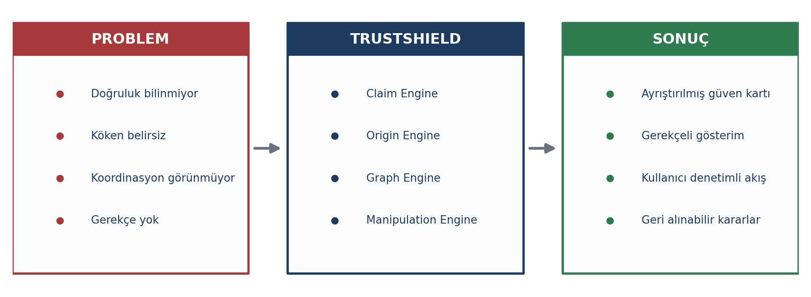
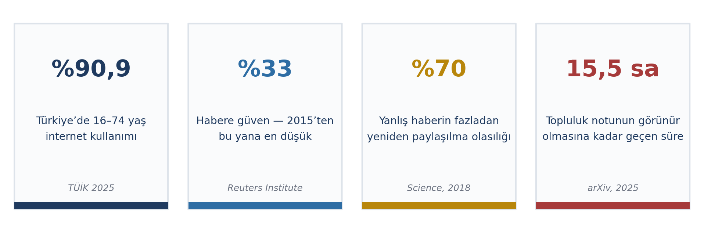
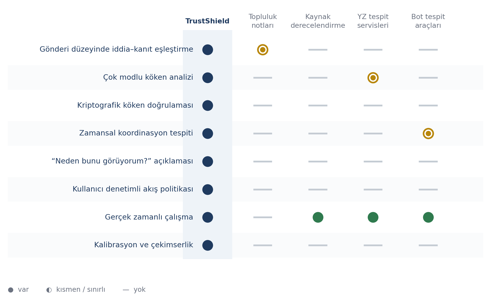

# 1-2. PROJE ÖZETİ VE KATMA DEĞER

> Toplam 30 puan. Bütçe: Bölüm 1 için 2,5 sayfa, Bölüm 2 için 4 sayfa.
> Atıf numaraları `docs/02-problem-kaynaklari.md` içindeki kaynakça taslağıyla uyumludur.

---

## 1. PROJE ÖZETİ

## 1.1. Proje Konusu ve Amacı

### Konu

Proje, sosyal medya kullanıcısının karşılaştığı içerik hakkında bilgi eksikliği problemine
odaklanmaktadır. Bugün bir kullanıcı akışında bir gönderiyle karşılaştığında dört temel
soruyu yanıtlayamaz:

| # | Kullanıcının bilmediği |
|---|---|
| 1 | İddia doğru mu ve kaynağı bunu gerçekten destekliyor mu? |
| 2 | İçerik yapay zekâ ile mi üretildi? |
| 3 | Paylaşan hesaplar organik mi, koordineli mi hareket ediyor? |
| 4 | Bu içerik kendisine neden gösteriliyor? |

Bu dört sorunun yanıtsız kalması, kullanıcıyı ya ayrım gözetmeyen bir şüpheye ya da
eleştirisiz bir kabule sürüklemektedir. **TrustShield, NSosyal uygulamasının içinde çalışan
ve bu dört soruyu her gönderi için yanıtlayan bir güven ve algoritma şeffaflığı katmanıdır.**

### Amaç

:::TASARIM İLKESİ
Sistem bir hakem değil, bir kanıt sunucusudur. Kullanıcıya neyin doğru olduğunu söylemez; karar verebilmesi için gereken bağlamı erişilebilir kılar.
:::

Bu ayrım projenin tasarım felsefesinin merkezindedir ve ölçülebilir bir hedefe dönüşür:
kullanıcının gördüğü her içerik için güvenilirlik, köken, yayılım bütünlüğü ve gösterim
gerekçesi bilgisini, kullanıcıdan ek çaba beklemeden ve akışı bekletmeden sunmak.

İkinci amaç, kullanıcının kendi akışı üzerindeki denetimi geri kazanmasıdır. Sistem içerik
silmez; kullanıcı, hangi tür içeriğin nasıl sıralanacağını doğal dille tanımlar ve verdiği
her karar geri alınabilir kalır.

### İnovasyon dikeyi

Proje, NSosyal İnovasyon Yarışması'nın **Sosyal Yapay Zekâ** inovasyon dikeyine hitap
etmektedir.

| Şartname çözüm alanı | TrustShield karşılığı |
|---|---|
| Büyük Dil Modelleri (LLM) | Claim Engine — iddia çıkarımı, kanıt eşleştirme, açıklama üretimi |
| Yapay zekâ destekli içerik moderasyonu | Manipulation Engine — retorik örüntü ve manipülasyon riski |
| Spam ve bot tespit sistemleri | Graph Engine — zamansal koordinasyon tespiti |
| İçerik özetleme | Kanıt özeti ve "Neden bunu görüyorum?" açıklaması |
| Duygu analizi | Manipülatif dil ve duygu/aciliyet sınıflandırması |
| Akıllı öneri sistemleri | Kullanıcı denetimli, gerekçeli akış sıralaması |
| Yapay zekâ tabanlı arama | Kanıt ve bağlam getirme (retrieval) katmanı |

Şartname ayrıca "yapay zekâ destekli yeni nesil sosyal medya platformları" ve "güvenli, etik,
şeffaf ve kullanıcı mahremiyetini ön planda tutan çözümler" geliştirilmesini hedeflemektedir;
TrustShield bu ikisine birden, yapay zekâyı platform deneyimini iyileştirmek için kullanıp
kullanıcı verisini cihazda tutan bir mimariyle hizmet eder.

## 1.2. Proje Kapsamı ve Yöntemi

### Kapsam ve sınırlar

| Kapsam İçinde | Kapsam Dışında |
|---|---|
| Gönderi metninden iddia çıkarımı ve kaynakla eşleştirme | İçerik silme, hesap kapatma veya herhangi bir yaptırım |
| Görsel/video için YZ üretimi sinyalleri ve köken doğrulama | Kanaat bildiren, normatif ifadelerin doğruluk puanlaması |
| Hesap–gönderi çizgesinde koordineli davranış tespiti | Gerçek platform kullanıcı verisinin işlenmesi (bu aşamada) |
| Manipülatif dil örüntülerinin sınıflandırılması | — |
| Ayrıştırılmış güven kartı olarak sunum | — |
| Doğal dille tanımlanan akış politikası denetimi | — |

Sistem yalnızca bağlam üretir ve kullanıcının tanımladığı politikaya göre sıralama önerir;
prototip NSosyal arayüzü örnek alınarak hazırlanan tohumlanmış bir veri kümesi üzerinde
çalışır.

### İzlenecek yöntem

| Aşama | İçerik |
|---|---|
| 1. Analiz | Literatür ve mevcut çözümlerin taranması, gereksinimlerin belirlenmesi |
| 2. Tasarım | Kademeli sistem mimarisi ve bileşen sınırlarının tanımlanması |
| 3. Geliştirme | Modellerin kamuya açık veri kümeleri üzerinde geliştirilmesi |
| 4. Doğrulama | Nicel başarım ölçümü ve kullanıcı testleri; çıktılar tasarıma geri beslenir |

Yöntemin akademik dayanağı üç alandadır: iddia çıkarımı ve doğal dil çıkarımı yoluyla
kanıt–iddia uyumunun ölçülmesi, çok modlu içerik köken analizi ve zamansal çizge öğrenmesi
(ayrıntılar Bölüm 3'te).

### Tema ile ilişki

Projenin Sosyal Yapay Zekâ dikeyiyle ilişkisi doğrudandır. Şartnamenin bu dikey için
vurguladığı dört nitelik, projede şöyle karşılanmaktadır:

| Şartname niteliği | Projedeki karşılığı |
|---|---|
| Güvenli | Mahremiyet odaklı mimari — kişisel veri cihazdan çıkmaz |
| Etik | Kullanıcı denetimli tasarım — içerik silinmez, karar kullanıcıda kalır |
| Ölçülebilir | Tanımlı başarım metrikleri (Bölüm 3.2) |
| Uygulanabilir | Mevcut, olgunlaşmış teknolojilerle kurulabilirlik |

### Prototip

Fikir, yarışma takvimi sonunda çalışan bir prototip ile desteklenecektir. Prototip, NSosyal
arayüzü örnek alınarak hazırlanan tohumlanmış bir akış üzerinde, güven kartı üretiminden
kullanıcı politikası tanımlamaya kadar temel kullanıcı akışlarını uçtan uca gösterecektir.

### Yeni çalışmalara zemin hazırlama

Proje, kendi kapsamının ötesinde iki yeniden kullanılabilir çıktı üretmektedir:

| Çıktı | Neden değerli |
|---|---|
| Özgün Türkçe değerlendirme kümesi | Türkçe iddia doğrulamada kaynak kıtlığı var; küme projeden bağımsız araştırmalara da temel oluşturabilir |
| Federe gözlem modeli | İstemcilerin anonim parmak izi katkısıyla dağıtık yayılım çizgesi kurma yöntemi; platform verisine erişimi olmayan araştırmacılar için de uygulanabilir |

---

## 2. KATMA DEĞER VE YENİLİKÇİLİK

## 2.1. Problem Tanımı ve Mevcut Çözümler

### Problemin tanımı ve büyüklüğü

Yanlış bilgi ve dezenformasyon, Dünya Ekonomik Forumu'nun 2026 Küresel Riskler Raporu'nda
kısa vadeli en ciddi küresel riskler arasında ikinci sırada yer almış; 67 ülkede ilk on risk
arasında gösterilmiştir [1]. Rapor, bu riskin diğer risklerin tamamını hızlandıran bir etken
olduğuna dikkat çekmektedir.

Problemin ölçeği ölçülebilirdir. Yanlış haberin sosyal ağlarda yeniden paylaşılma olasılığı
doğru haberden %70 daha yüksektir; doğru bir haberin 1.500 kişiye ulaşması, yanlış bir
haberinkinden altı kat daha uzun sürmektedir [3]. Bu bulgu, 2006-2017 arasında yaklaşık
126.000 söylenti zinciri ve üç milyon kullanıcı üzerinde yapılan inceleme sonucunda elde
edilmiştir. Yanlış bilgi yalnızca var olmakla kalmamakta, doğru bilgiden yapısal olarak daha
hızlı yayılmaktadır.

Üretim maliyetindeki düşüş bu tabloyu ağırlaştırmaktadır. Avrupa Birliği kurumlarının
değerlendirmesine göre çevrimiçi içeriğin 2026 yılına kadar %90'a varan oranda sentetik
olarak üretilmesi öngörülmüştür [4]. Nitekim 2025 yılında 900.000 web sayfası üzerinde
yapılan bir inceleme, yeni oluşturulan sayfaların %74'ünün yapay zekâ üretimi içerik
barındırdığını, ancak yalnızca %2,5'inin tümüyle yapay zekâ üretimi olduğunu, geri kalanının
insan–yapay zekâ karışımı olduğunu göstermiştir [10]. Bu ayrım önemlidir: içerik kökeni
artık ikili bir sorudan çok bir derece sorusudur.

Türkiye ölçeğinde problem doğrudan geniş bir kitleyi ilgilendirmektedir. Türkiye İstatistik
Kurumu'nun 2025 verilerine göre 16-74 yaş grubunda internet kullanım oranı %90,9'a
yükselmiş; en çok kullanılan uygulamalar sırasıyla %88,6 ile WhatsApp, %72,9 ile YouTube ve
%68,1 ile Instagram olmuştur [2]. Aynı dönemde Türkiye'de habere duyulan genel güven %33 ile
2015'ten bu yana en düşük düzeye gerilemiş, kullanıcıların %36'sı haberi sosyal medya
üzerinden paylaşır hâle gelmiştir [5]. Küresel ölçekte katılımcıların %58'i çevrimiçi
haberlerde neyin gerçek neyin sahte olduğu konusunda endişe duyduğunu belirtmektedir [6].

:::PROBLEMİN DÖRT BOYUTU
İddianın doğruluğu ve kaynakla uyumu bilinmiyor · İçeriğin kökeni belirsiz · Yayılımın organik mi koordineli mi olduğu ayırt edilemiyor · İçeriğin kullanıcıya neden gösterildiği açıklanmıyor
:::

### Mevcut çözümler ve yetersizlikleri

| Çözüm | Yaklaşım | Yetersizlik |
|---|---|---|
| Topluluk notları | Kullanıcı katkısıyla gönderiye bağlam notu eklenmesi | Not ortalama 15,5 saatte görünür hâle gelmekte, o ana kadar yeniden paylaşımların %80'i gerçekleşmiş olmaktadır. Gönderilen notların yalnızca %11'i "faydalı" statüsüne ulaşabilmekte, toplam yeniden paylaşım azalması yaklaşık %11'de kalmaktadır [8,9] |
| Bağımsız doğrulama kuruluşları | Uzman incelemesiyle iddia doğrulama | Manuel süreç akış hızına yetişememekte; kapsam sınırlı kalmakta; değerlendirme çoğunlukla olay sonrasında yayımlanmaktadır |
| Kaynak güven derecelendirmeleri | Yayın organı düzeyinde güvenilirlik puanı | Kaynak düzeyinde çalışmakta, gönderi düzeyinde çalışmamaktadır; güvenilir bir kaynağın bağlamından koparılarak paylaşılmasını yakalayamamaktadır |
| Yapay zekâ içerik tespit servisleri | Metin veya görselde üretim olasılığı kestirimi | Genellikle tek modal; olasılık kalibrasyonu yapılmamakta; açıklama üretmemekte; yeni üretim modellerine genelleme sorunu yaşamaktadır |
| Bot tespit araçları | Hesap düzeyinde otomasyon skoru | Statik ve tek hesap odaklıdır; birbirini takip etmeyen ancak eşgüdümlü hareket eden hesap kümelerini ve bunların zamansal imzasını kaçırmaktadır [7] |
| Platform öneri sistemleri | Kişiselleştirilmiş içerik sıralaması | Kapalı kutu olarak işlemekte; kullanıcıya gösterim gerekçesi sunmamakta ve anlamlı bir denetim imkânı vermemektedir |

Bu çözümlerin ortak eksikliği yalnızca tekil sınırlarında değil, birbirinden bağımsız
çalışmalarındadır. Hiçbiri, kullanıcının ekranındaki tek bir gönderi için doğruluk, köken,
yayılım ve gösterim gerekçesi sorularının dördünü birlikte yanıtlamamaktadır. Kullanıcı
açısından sonuç, dört farklı aracı bilmesi, bulması ve kullanması gerektiğidir; pratikte bu,
söz konusu araçların hiçbirinin kullanılmaması anlamına gelmektedir.

## 2.2. Çözüm Fikri, Özgünlük ve Yerlilik

### Çözüm

TrustShield, NSosyal içinde çalışan bütünleşik bir güven katmanıdır. Her gönderi dört analiz
motorundan geçer: iddia çıkarımı ve kanıt eşleştirmesi yapan Claim Engine; yapay zekâ üretimi
sinyallerini ve içerik kökenini değerlendiren Origin Engine; koordineli yayılımı tespit eden
Graph Engine; ve manipülatif dil örüntülerini sınıflandıran Manipulation Engine. Çıktılar tek
bir puana indirgenmez; kullanıcıya kaynak kalitesi, kanıt uyumu, yapay zekâ üretimi olasılığı,
manipülasyon riski ve ağ bütünlüğü boyutlarını ayrı ayrı gösteren bir güven kartı sunulur.
Her gönderide "Neden bunu görüyorum?" açıklaması bulunur ve kullanıcı akış politikasını doğal
dille tanımlayabilir.

### Güçlü ve yenilikçi yönler

Çözümün dört özgün yönü bulunmaktadır:

| Özgün yön | Açıklama |
|---|---|
| Bütünleşik değerlendirme | Piyasada ayrı ayrı bulunan doğrulama, köken tespiti, bot analizi ve öneri şeffaflığı ortak bir gönderi kimliğinde birleşir |
| Kademeli mimari ve iddia düzeyinde tekilleştirme | İşlem birimi gönderi değil iddiadır; maliyet benzersiz iddia sayısıyla orantılıdır, ağır modeller yalnızca şüpheli/viral içerikte çalışır |
| Zamansal çizge analizi | Statik hesap özniteliği yerine paylaşım ritmi öznitelik hâline getirilir; koordineli hesapların dar pencerede yoğunlaştığı akademik olarak gösterilmiştir [7] |
| Bağlam ekleme ve kullanıcı denetimi | İçerik silinmez; aşağı sıralanan içerik gerekçesiyle görünür kalır ve tek işlemle geri getirilebilir |

### Mevcut çözümlerle karşılaştırma

### Pazarda uygulanabilirlik

Çözümün pazara girişindeki en büyük avantajı, bağımsız bir uygulama değil **platform içi bir
alt sistem** olarak konumlanmasıdır — bu, benzer ürünlerin başarısız olduğu kullanıcı kazanımı
sorununu ortadan kaldırır: NSosyal'e entegre edildiğinde platformun mevcut kullanıcı tabanının
tamamına ek maliyetsiz ulaşır. Bileşenlerin tamamı bugün üretim ortamlarında kullanılan
teknolojilerle kurulabilir; proje yeni bir model mimarisi icadına bağımlı değildir.

### Yerli bileşen ve teknolojiler

Proje, Türkçe dil işleme katmanında yerli açık kaynak teknolojileri kullanmaktadır:

| Bileşen | Teknoloji | Rol |
|---|---|---|
| Biçimbilimsel çözümleme, kök bulma | Zemberek | Türkçeye özgü normalizasyon |
| Dil modeli katmanı | BERTurk | Türkçe için eğitilmiş temel model |
| Değerlendirme verisi | Özgün Türkçe küme (elle etiketli) | Yerli veri varlığı — kaynak kıtlığını giderir |
| Hedef platform | NSosyal | Yerli sosyal medya platformu; yurt dışı servislere bağımlılığı azaltır |
