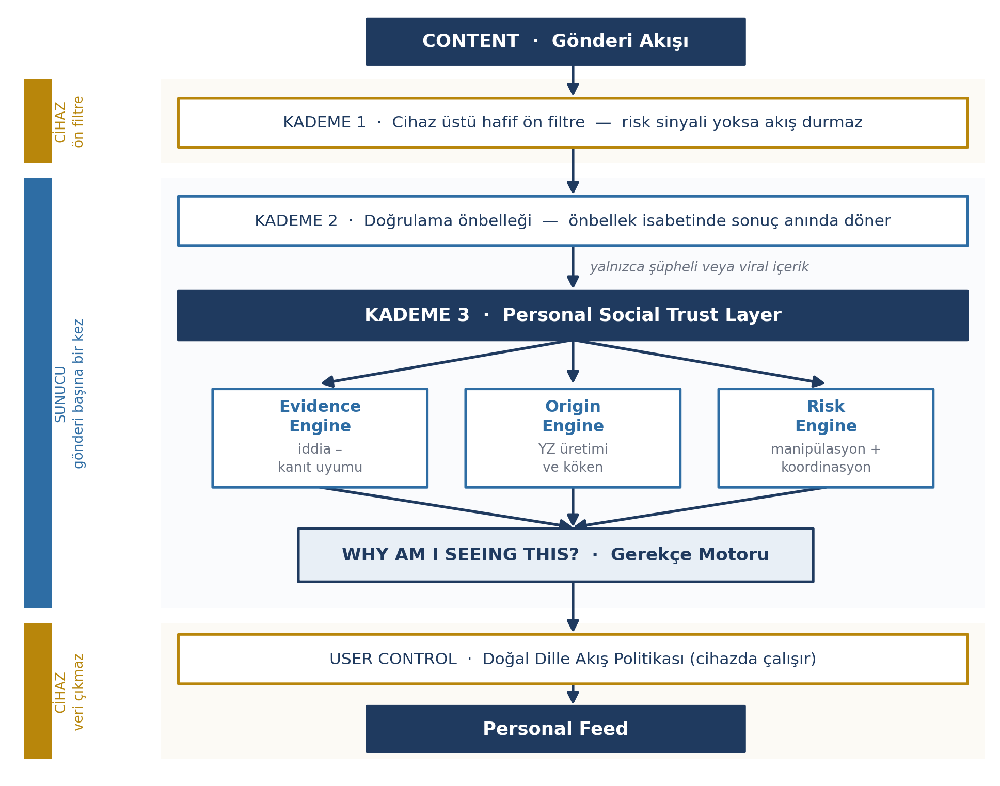
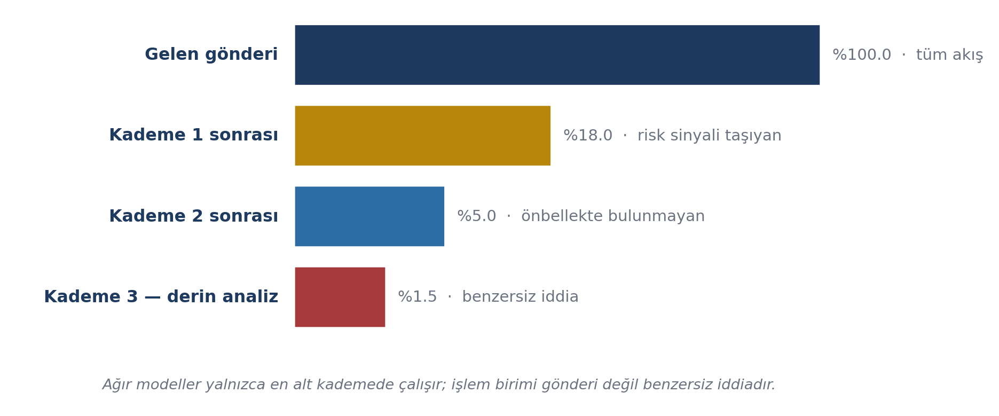
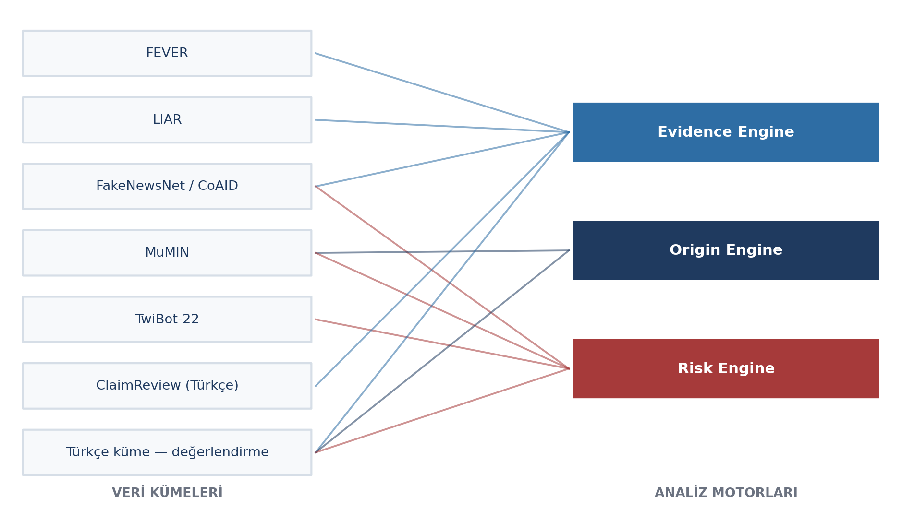
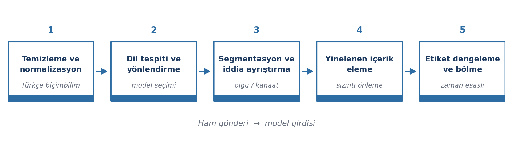
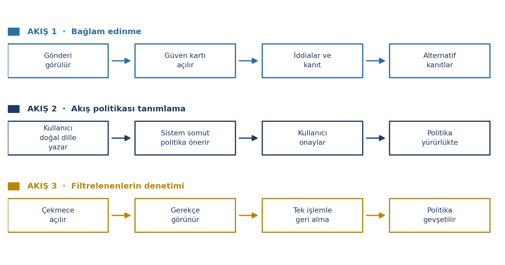
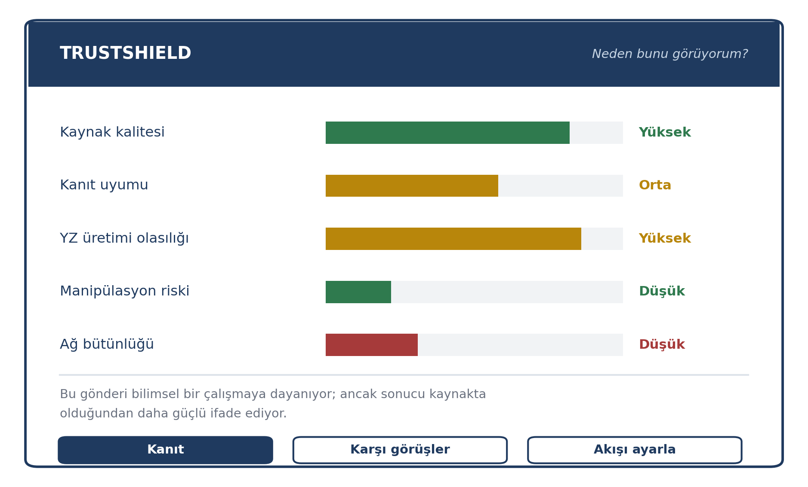

# 3. TEKNOLOJİ KULLANIMI

> Rapora aktarılacak metin. Toplam 20 puan, bütçe 8 sayfa — raporun en ağır bölümü.
> **[DOLDURUN: ...]** işaretli yerler takımın karar vermesi gereken noktalardır; teslimden
> önce hiçbiri kalmamalıdır. Metrik hedefleri ölçüm sonucu değil hedef olarak yazılmıştır;
> ölçüm yapıldıkça gerçek değerlerle değiştirin.

---

## 3.1. İzlenecek Yöntem, Altyapı ve Sürüm Kontrolü

### Geliştirme yöntemi

Dört aşamalı yinelemeli süreç Bölüm 1.2'de tanımlanmıştır. Yöntemin akademik temeli üç
alana dayanmaktadır:

| Alan | Kullanım amacı |
|---|---|
| İddia çıkarımı ve doğal dil çıkarımı | Kanıt–iddia eşleştirmesi |
| Çok modlu içerik köken analizi | YZ üretimi sinyalleri ve köken doğrulama |
| Zamansal çizge öğrenmesi | Koordinasyon tespiti — davranış ritmi statik özniteliklerin yakalayamadığı bir sinyaldir [7] |

### Sistem mimarisi

Sistem, hesaplama maliyetini ve gecikmeyi denetim altında tutmak için kademeli bir yapıda
kurgulanmıştır. Her gönderi tüm modellerden geçmez; yalnızca risk sinyali taşıyan içerik
bir üst kademeye yükselir.

Mimarinin temel ayrımı şudur: **içerik düzeyindeki analiz sunucuda, gönderi başına bir kez**
yapılır ve o gönderiyi gören tüm kullanıcılara ortak olarak sunulur; **kullanıcı düzeyindeki
kişiselleştirme ise cihazda** yürütülür. Bu ayrım hem maliyeti kullanıcı sayısından
bağımsızlaştırır hem de kişisel tercih verisinin sunucuya taşınmasını gereksiz kılar.

### Analiz motorları

| Motor | Girdi | Yöntem | Çıktı |
|---|---|---|---|
| Claim Engine | Gönderi metni, bağlantılar | İddia çıkarımı, kaynak getirme, doğal dil çıkarımı ile kanıt–iddia uyumu | İddia listesi, kanıt uyum skoru, kaynak kalitesi |
| Origin Engine | Görsel, video karesi, metin | Çok modlu üretim sinyalleri, OCR, içerik köken verisi (C2PA) doğrulaması | Yapay zekâ üretimi olasılığı, düzenleme sinyali, doğrulanmış köken |
| Graph Engine | Hesap–gönderi–bağlantı–etkileşim çizgesi | Zamansal çizge öğrenmesi, topluluk tespiti, anomali tespiti | Ağ bütünlüğü skoru, koordineli küme etiketi |
| Manipulation Engine | Gönderi metni | Retorik örüntü sınıflandırması, duygu ve aciliyet analizi | Manipülasyon riski, tetiklenen örüntüler |

Motorların çıktıları tek bir puana indirgenmez. Bir içerik doğru olup manipülatif, yapay
zekâ ile üretilmiş olup isabetli olabilir; bu nedenle kullanıcıya ayrıştırılmış bir güven
kartı sunulur.

Claim Engine'in kanıt getirme katmanı, doğrulanabilir olgusal iddialar için üç kaynak
grubuna dayanır: resmî açık veri (Resmî Gazete, TÜİK, AFAD, DSÖ), açık doğrulama arşivleri
(Teyit.org ve benzeri kuruluşların yayımladığı ClaimReview kayıtları — bkz. aşağıdaki veri
kümeleri tablosu) ve Qdrant üzerinde çalışan vektör tabanlı semantik arama. Bu üçü,
sistemin "kanıtı nereden getirdiği" sorusuna somut bir cevap oluşturur.

### Aşamalı uygulama stratejisi (MVP)

Dört motorun tamamını üretim kalitesinde eş zamanlı geliştirmek yarışma takvimiyle gerçekçi
değildir; bu nedenle geliştirme kademeli bir MVP stratejisiyle planlanmıştır.

| Aşama | Claim Engine | Manipulation Engine | Origin Engine | Graph Engine |
|---|---|---|---|---|
| Prototip (bkz. Bölüm 7) | Gerçek model, uçtan uca ölçülür | Gerçek model, uçtan uca ölçülür | Kural tabanlı + önceden hazırlanmış örnek çıktı | Kural tabanlı + önceden hazırlanmış örnek çıktı |
| Final ve sonrası | Ölçeklendirme | Ölçeklendirme | Gerçek model devreye alınır | Gerçek model devreye alınır |

Mimari ve arayüz dört motor için de tam tasarlanmıştır; prototip aşamasında hangi
motorların gerçek modelle, hangilerinin kural tabanlı bir yer tutucuyla temsil edildiği
rapor ve sunumda açıkça belirtilir.

### Teknoloji yığını

| Katman | Teknoloji | Gerekçe |
|---|---|---|
| İstemci | Flutter | Tek kod tabanından mobil ve web arayüzü; hedef platformla aynı ortamda çapraz platform entegrasyon |
| Cihaz üstü çıkarım | ONNX Runtime Mobile / TensorFlow Lite | Kuantize edilmiş küçük modellerin düşük gecikmeyle çalıştırılması |
| Ön filtre modeli | Damıtılmış Türkçe kodlayıcı (BERTurk tabanlı, kuantize) | Küçük boyut, cihazda çalışabilirlik |
| Gömme ve vektör arama | Çok dilli cümle gömme modeli + Qdrant | Yüksek performanslı, açık kaynaklı, filtreleme destekli vektör arama; yakın kopya ve iddia eşleştirme |
| Dil modeli katmanı | Açık kaynaklı, Türkçe LoRA ince ayarlı bir LLM (ör. Llama 3.1 8B Instruct); maliyet/gecikme dengesi gerektiren senaryolarda bulut API yedeği (ör. Gemini Flash) | İddia çıkarımı, kanıt karşılaştırma, açıklama üretimi |
| Türkçe dil işleme | Zemberek (biçimbilimsel çözümleme), BERTurk | Türkçe normalizasyon ve kök bulma — **yerli bileşen** |
| Görsel / çok modlu | SigLIP / CLIP-ViT-B/16 görüntü kodlayıcı + Tesseract OCR | Görsel üretim sinyalleri ve görsel içi metin |
| İçerik kökeni | C2PA / Content Credentials doğrulayıcı + CNN/ViT tabanlı piksel artefakt sınıflandırıcı | Meta veri mevcutsa kriptografik kanıt; çoğu içerikte olduğu gibi meta veri silinmiş/yoksa istatistiksel sinyale geri dönülür (bkz. Origin Engine notu) |
| Çizge katmanı | PyTorch Geometric Temporal (TGN/TGAT ailesi) | Zamansal çizge sinir ağları |
| Sunucu | Python, FastAPI | Model servis etme ve REST arayüzü |
| Kuyruk ve önbellek | Redis + Celery | Bellek içi hızlı önbellek ve asenkron görev kuyruğu |
| Veri tabanı | PostgreSQL | İddia, kaynak ve skor kaydı |
| Dağıtım | Docker; AWS GPU örnekleri (veri egemenliği gerekirse yerli bir buluta taşınabilir mimari) | Yatay ölçeklenebilirlik |

**Origin Engine'de C2PA kapsam sınırı.** Bugün viral içeriğin büyük kısmı C2PA meta verisi
taşımaz — çoğu platform yükleme sırasında boyut küçültmek için EXIF/C2PA meta verisini
siler ve standardın endüstri benimsemesi henüz erken aşamadadır. Bu nedenle Origin Engine
**hibrit** çalışır: meta veri mevcutsa C2PA doğrulaması birincil kanıt olur; mevcut değilse
(pratikte çoğunluk durum) sistem piksel artefaktı sınıflandırıcısına ve istatistiksel
YZ-üretimi sinyallerine geri döner. Rapor genelinde "yapay zekâ üretimi olasılığı" dilinin
kesinlik değil olasılık ifade etmesinin nedeni budur.

### Veri kümeleri ve analiz yöntemleri

Prototip, gerçek NSosyal kullanıcı verisi üzerinde değil, NSosyal arayüzü örnek alınarak
hazırlanan tohumlanmış bir veri kümesi üzerinde çalışacaktır. Modellerin geliştirilmesi ve
doğrulanması ise kamuya açık veri kümeleri üzerinde yapılmaktadır.

| Veri kümesi | İçerik | Kullanım amacı |
|---|---|---|
| FEVER | Doğrulanmış iddia–kanıt çiftleri | İddia çıkarımı ve kanıt uyumu modelinin eğitimi |
| LIAR | Etiketli siyasi iddialar | Doğruluk sınıflandırması |
| FakeNewsNet / CoAID | Haber içeriği + sosyal bağlam | Yayılım ve içerik birlikte değerlendirme |
| MuMiN | Çok modlu yanlış bilgi + sosyal çizge | Çok modlu ve çizge bileşenlerinin birlikte doğrulanması |
| TwiBot-22 | Çizge yapılı bot tespiti | Graph Engine eğitimi ve karşılaştırma |
| Google Fact Check Tools (ClaimReview) | Kurumsal doğrulama kayıtları, Türkçe dâhil | Doğrulama önbelleğinin tohumlanması |
| **Türkçe değerlendirme kümesi (özgün)** | Hedef 300 gönderi, elle etiketli (prototip için ilk 50-100 ile başlanır) | Türkçe başarımın ölçülmesi |

Türkçe kaynakların kıtlığı bu alanın bilinen bir kısıtıdır. Bu nedenle projede, takım
tarafından elle etiketlenen özgün bir Türkçe değerlendirme kümesi oluşturulmaktadır. Küme;
iddia içerip içermediği, iddianın olgusal mı kanaat mi olduğu, kanıt durumu ve manipülatif
dil örüntüsü boyutlarında etiketlenmekte, her örnek en az iki bağımsız etiketleyici
tarafından değerlendirilmekte ve etiketleyiciler arası uyum ölçülmektedir. Bu küme,
projenin literatüre bırakacağı yeniden kullanılabilir çıktılardan biridir.

### Sürüm kontrolü

Projenin tüm kaynak kodu, geliştirme sürecinin başından itibaren dağıtık sürüm kontrol
sistemi ile yönetilmektedir.

**Depo adresi:** https://github.com/ahmettalhabahadir/TrustShield

Geliştirme `main` dalı korunacak biçimde, özellik dalları üzerinden yürütülmektedir.
Her değişiklik tek bir işlevsel birimi kapsayan commit'ler hâlinde kaydedilmekte, commit
mesajları yapılan değişikliği özetleyen standart bir biçimde yazılmaktadır. Böylece
geliştirme adımları commit geçmişi üzerinden kronolojik olarak izlenebilmektedir. Depo,
jüri incelemesine açıktır.

---

## 3.2. Model ve Veri Doğrulama

### Veri ön işleme

Ön işleme hattı, ham gönderiyi model girdisine dönüştüren beş adımdan oluşur:

| Adım | İşlem | Neden önemli |
|---|---|---|
| 1. Temizleme ve normalizasyon | Biçimlendirme artıklarının temizlenmesi, Türkçeye özgü büyük/küçük harf ve `i` ayrımı, Zemberek ile kök bulma | Yanlış normalizasyon gömme kalitesini bozar |
| 2. Dil tespiti ve yönlendirme | Türkçe içerik Türkçe modellere, diğerleri çok dilli modele yönlendirilir | Doğru model seçimi |
| 3. Segmentasyon ve iddia ayrıştırma | Doğrulanabilir önermeler, olgu/kanaat ayrımı ile çıkarılır | Kanaat skorlanmama ilkesinin veri karşılığı |
| 4. Yinelenen içerik eleme | Kopya/yakın kopya örnekler gömme benzerliğine göre elenir | Eğitim–test sızıntısını engeller |
| 5. Etiket dengeleme ve bölme | Azınlık sınıfı ağırlıklandırılır; çizge/zamansal bileşenlerde bölme **zaman esaslı** yapılır | Test kümesi eğitim penceresinden sonraki döneme ait olmalıdır |

### Model eğitimi

Her görev için sıfırdan eğitim yerine, alana uygun ön eğitimli modellerin ince ayarı
tercih edilmiştir. Bu tercih hem sınırlı etiketli veriyle çalışmayı mümkün kılar hem de
hesaplama maliyetini düşürür.

| Görev | Başlangıç modeli | Eğitim yaklaşımı |
|---|---|---|
| Ön filtre (risk sinyali) | Damıtılmış Türkçe kodlayıcı | İkili sınıflandırma, ardından kuantizasyon ve cihaz üstü dağıtım |
| İddia çıkarımı | Dil modeli katmanındaki LLM'in ince ayarlı sürümü | Dizi etiketleme / üretimsel çıkarım |
| Kanıt–iddia uyumu | Çok dilli doğal dil çıkarımı modeli | Üç sınıflı çıkarım (destekler / çelişir / yetersiz) ince ayarı |
| Manipülatif dil | BERTurk | Çok etiketli sınıflandırma (aciliyet, korku, sosyal baskı) |
| Yapay zekâ üretimi tespiti | CNN/ViT tabanlı piksel artefaktı sınıflandırıcısı (görsel), ince ayarlı BERTurk (metin) | İkili sınıflandırma + olasılık kalibrasyonu |
| Koordinasyon tespiti | TGN/TGAT ailesi | Zamansal bağlantı tahmini ve düğüm sınıflandırması |

Hiperparametre seçimi doğrulama kümesi üzerinde ızgara veya rastgele arama ile yapılmakta,
tüm deneyler sabit rastgelelik tohumuyla tekrarlanabilir biçimde kaydedilmektedir. Eğitim
donanımı: geliştirme için 1× NVIDIA RTX 4090 (24 GB VRAM); büyük ölçekli ince ayarlar için
Google Colab Pro+ / A100 GPU.

### Aşırı öğrenme önlemleri

Aşırı öğrenmeye karşı altı önlem birlikte uygulanmaktadır:

| # | Önlem | Amaç |
|---|---|---|
| 1 | Tabakalı bölme | Sınıf dağılımının üç kümede de korunması |
| 2 | Çapraz doğrulama | Tek bölmeye bağlı sonuç raporlanmasının önlenmesi |
| 3 | Erken durdurma | Doğrulama kaybı iyileşmeyince eğitimin sonlandırılması |
| 4 | Düzenlileştirme | Dropout ve ağırlık sönümü ile kapasite sınırlama |
| 5 | Sınıf ağırlıklandırma | Azınlık sınıfının ezilmesinin engellenmesi |
| 6 | **Zamansal ayrım** | Test verisi eğitim penceresinden sonraki döneme ait olmalı — rastgele bölme geleceğe ait bilgiyi sızdırıp başarımı yapay yükseltir |

Modellerin genelleme yeteneği ayrıca, eğitimde hiç görülmemiş bir veri kümesi üzerinde alan
dışı sınamayla da kontrol edilir.

### Performans metrikleri

Aşağıdaki değerler ölçüm sonucu değil, benzer görevlerdeki literatür aralıklarından
türetilmiş hedeflerdir — projenin doğrulama aşamasında ulaşmayı hedeflediği eşikleri
gösterir. Ölçümler tamamlandıkça gerçek değerlerle güncellenecektir.

| Bileşen | Metrik | Hedef | Dayanak |
|---|---|---|---|
| İddia çıkarımı | F1 | ≥ 0,75 | FEVER benzeri görevlerde yaygın literatür aralığı |
| Kanıt getirme | Recall@5 | ≥ 0,80 | Yoğun getirme (dense retrieval) literatüründe tipik hedef |
| Kanıt–iddia uyumu | Makro F1 | ≥ 0,70 | Üç sınıflı doğal dil çıkarımı görevlerinde tipik aralık |
| Manipülatif dil | Makro F1 | ≥ 0,75 | Çok etiketli metin sınıflandırmada tipik aralık |
| Yapay zekâ üretimi tespiti | AUROC / beklenen kalibrasyon hatası | ≥ 0,85 / ≤ 0,05 | Kalibrasyon hedefi doğruluktan daha belirleyici (bkz. aşağıdaki not) |
| Koordinasyon tespiti | Precision@k | ≥ 0,70 | Çizge tabanlı anomali tespitinde tipik aralık |
| Uçtan uca gecikme | Kademe bazında p50 / p95 | Kademe 1-2 eşzamanlı, Kademe 3 asenkron | Mimari tasarım gereği |
| Hatalı işaretleme | Doğru içerikte yanlış pozitif oranı | ≤ 0,05 | 4.1'deki maliyet/güven dengesiyle tutarlı muhafazakâr hedef |

İki ölçüm tercihi özellikle vurgulanmalıdır. Birincisi, sınıflandırma doğruluğunun yanında
**olasılık kalibrasyonunun** ölçülmesidir; sistemin ürettiği olasılıkların gerçek
sıklıklarla örtüşmesi, kullanıcıya sunulan güven ifadesinin anlamlı olması için
doğruluktan daha belirleyicidir. İkincisi, **yanlış pozitif oranının** ayrı bir başarım
ölçütü sayılmasıdır; doğru bir içeriğin şüpheli olarak işaretlenmesinin maliyeti, şüpheli
bir içeriğin gözden kaçmasının maliyetinden yüksektir.

:::ÇEKİMSERLİK İLKESİ
"Yetersiz kanıt" sistemin çıktı kümesinde birinci sınıf bir sonuçtur. Kanıt düzeyi eşiğin altında kaldığında model sınıflandırma yapmak yerine çekimser kalır; skorlar nokta değer olarak değil güven aralığıyla üretilir.
:::

### Düşmanca dayanıklılık

Sistem, düşmanın ürettiği metni işleyen bir dil modeli içerdiğinden dolaylı komut
enjeksiyonuna açık bir yüzeye sahiptir: gönderi metnine gömülen "önceki talimatları yok say"
gibi ifadeler modelin davranışını değiştirmeyi hedefleyebilir.

| Tehdit | Önlem |
|---|---|
| Dolaylı komut enjeksiyonu | İçerik model istemine talimat değil, ayrı kanaldan veri olarak geçirilir |
| Şema dışı / manipüle edilmiş çıktı | Model yapılandırılmış çıktı üretmeye zorlanır, şema dışı çıktı reddedilir |
| Talimat benzeri örüntüler | Ön işleme aşamasında işaretlenir |
| Tespit atlatma amaçlı yeniden yazım | Değerlendirme kümesine bilinçli düşmanca örnekler eklenir |
| Sahte kurum atfı | Aynı şekilde düşmanca örneklerle sınanır |

---

## 3.3. Kullanıcı Deneyimi (UI/UX) Tasarımı

### Kullanıcı akışları

| Akış | Örnek tetikleyici | Sonuç |
|---|---|---|
| 1 — Bağlam edinme | Kullanıcı "Kanıt" düğmesine dokunur | İddialar kaynak ve kanıt durumuyla listelenir; "Karşı görüşler" farklı bulguları kanıt düzeyiyle gösterir |
| 2 — Akış politikası tanımlama | "Son zamanlarda çok fazla tartışmalı içerik görüyorum" | Sistem somut politika önerir ("manipülasyon riskli içeriği azalt"), kullanıcı onaylar, politika ayarlarda düzenlenebilir kalır |
| 3 — Filtrelenenlerin denetimi | Kullanıcı "Filtrelenenler" çekmecesini açar | Aşağı sıralanan içerikler gerekçesiyle listelenir; tek işlemle geri getirilir veya politika gevşetilir |

### Arayüz tasarım kararları

| Karar | Gerekçe |
|---|---|
| Tek skor yerine ayrıştırılmış güven kartı | Bir içerik doğru olup manipülatif olabilir; tek sayı bu ayrımı yok eder ve yanıltıcıdır |
| Ölçülemeyen boyutlarda sayı yerine bant (Yüksek/Orta/Düşük/Yetersiz kanıt) | Hesaplanmayan bir boyutta sözde hassas sayı vermek güveni zedeler |
| Kesinlik yerine olasılık dili | Yapay zekâ üretimi tespiti hâlâ genelleme sorunu yaşayan bir alandır; "%100 yapay zekâ" ifadesi teknik olarak savunulamaz |
| Varsayılan davranış gizleme değil etiketleme | Sistemin sansür aracına dönüşmemesi; kararın kullanıcıda kalması |
| Aşağı sıralanan içeriğin görünür kalması | Her kararın denetlenebilir ve geri alınabilir olması |
| Kademeli açılım: rozet anında, kanıt kartı arkadan | Derin analiz asenkrondur; akışın beklemesi kullanıcı deneyimini bozar |
| Ayarlar yerine sohbet | Onlarca seçenek yerine niyet ifadesi; düşük dijital okuryazarlıkta da kullanılabilirlik |

### Erişilebilirlik yaklaşımı

Arayüz **WCAG 2.2 AA** düzeyi hedeflenerek tasarlanmaktadır:

| Boyut | Yaklaşım |
|---|---|
| Renkten bağımsız bilgi | Güven düzeyi renk + ikon + metin etiketi olmak üzere üç kanaldan birden aktarılır |
| Kontrast ve ölçek | AA eşiğini karşılayan kontrast; işletim sistemi yazı boyutu ayarına uyum |
| Ekran okuyucu uyumu | Her boyut anlamlı etiketle okunur ("kaynak kalitesi: yüksek"); ikon denetimler metin alternatifi taşır |
| Dokunma hedefleri | Motor becerisi kısıtlı kullanıcılar için asgari dokunma alanı |
| Bilişsel erişilebilirlik | Kanıt kartı varsayılan olarak özet açılır; gündelik dil kullanılır |

Bu son madde özellikle belirleyicidir: doğrulama alışkanlığı olmayan kullanıcılar, karmaşık
arayüzden en çok etkilenen kesimle büyük ölçüde örtüşür.

### Kullanılabilirlik testi

Tasarım kararları, görev tabanlı bir kullanılabilirlik testiyle sınanacaktır. Test
protokolü mentörlük döneminde uygulanmak üzere şu şekilde tanımlanmıştır: 5-8
katılımcıdan üç görev tamamlaması istenecektir — bir gönderinin güven bilgisine ulaşmak,
akış politikası tanımlamak ve filtrelenen bir içeriği geri getirmek.

| Ölçülecek gösterge | Yöntem |
|---|---|
| Görev tamamlama oranı | Her görev için başarılı/başarısız tamamlama yüzdesi |
| Görev başına süre | Görev başlangıcından tamamlanmasına kadar geçen süre |
| Sistem Kullanılabilirlik Ölçeği (SUS) | Standart 10 maddelik SUS anketi, test sonrası |

Test sonuçları ve bunlara karşılık yapılan tasarım değişiklikleri, mentörlük döneminde
tamamlanıp final raporuna eklenecektir.
