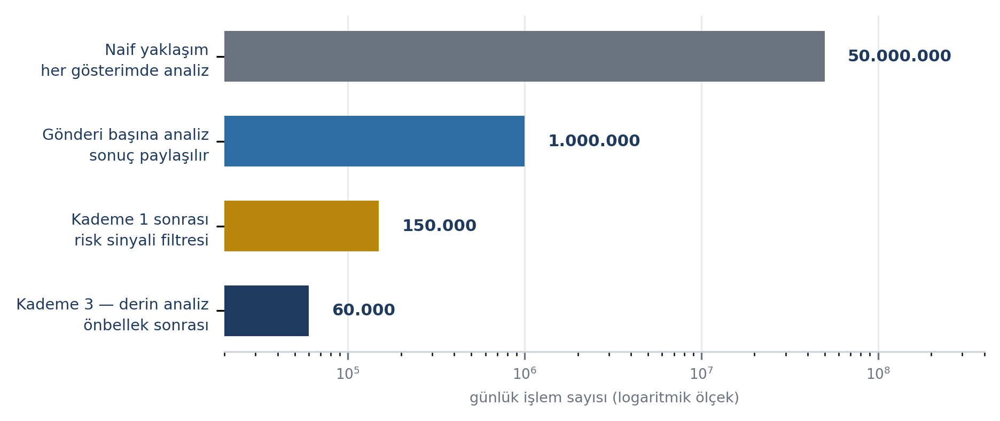
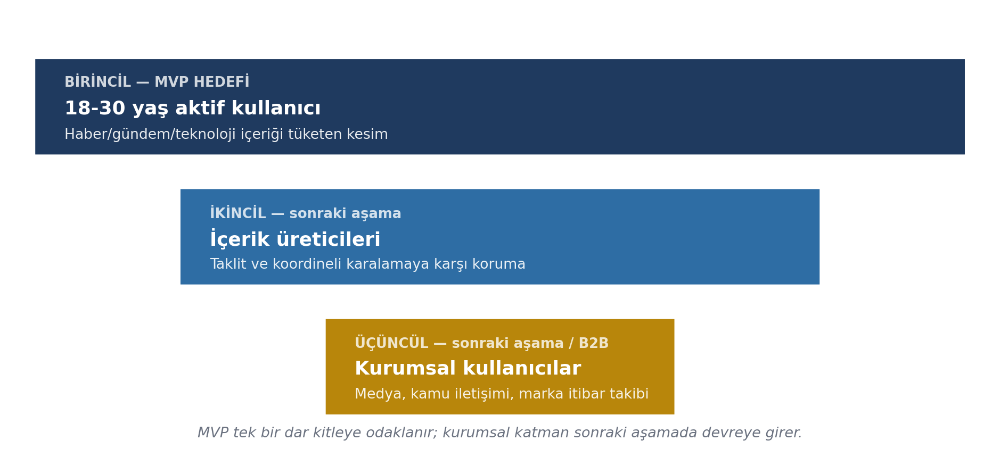

# 4. UYGULANABİLİRLİK

> Toplam 15 puan, bütçe 3,5 sayfa.

---

## 4.1. Verimlilik ve Etkinlik

### Hesaplama maliyetinde sağlanan verimlilik

Sosyal medya ölçeğinde çalışan bir güven katmanının önündeki temel engel doğruluk değil
**maliyettir**. Kademeli mimari bu maliyeti üç mekanizmayla düşürür:

| Mekanizma | Nasıl çalışır | Etkisi |
|---|---|---|
| Gönderi başına analiz | İçerik düzeyindeki analiz bir kez yapılıp tüm izleyicilere sunulur | Maliyet kullanıcı sayısından bağımsızlaşır |
| İddia düzeyinde tekilleştirme | Aynı iddiayı taşıyan farklı gönderiler tek doğrulama sonucunu paylaşır | Viral içerikte tekrarlı analiz önlenir |
| Kademeli eleme | Olgusal iddia içermeyen gönderiler Kademe 1'de ayrılır | Bu içerik hiçbir sunucu maliyeti üretmez |

Aşağıdaki tablo bir **mimari tahmin/örnek senaryodur**, ölçülmüş bir sonuç değildir;
varsayımlar platform verisiyle doğrulandıkça güncellenecektir.

| Aşama | Mekanizma | Günlük işlem (örnek senaryo) |
|---|---|---|
| Naif yaklaşım | Her gösterimde tam analiz | 50.000.000 |
| Gönderi başına analiz | Sonucun tüm izleyicilerle paylaşılması | 1.000.000 |
| Kademe 1 sonrası | Risk sinyali taşımayan içeriğin elenmesi (%85 varsayım) | 150.000 |
| Kademe 2 sonrası | Doğrulama önbelleği isabeti (%60 varsayım) | 60.000 |
| **Kademe 3 — derin analiz** | **Evidence/Origin/Risk motorları** | **60.000** |

*Varsayımlar: günlük 1.000.000 gönderi, gönderi başına ortalama 50 gösterim, Kademe 1
eleme oranı %85, önbellek isabet oranı %60. Bu bir simülasyondur, ölçülmüş bir üretim
verisi değildir.*

Bu senaryoda ağır modeller toplam gönderilerin yalnızca **%6'sı** için çalışır. Platform
büyüdükçe önbellek isabet oranının yükselmesi beklenir, dolayısıyla birim maliyetin
ölçekle birlikte düşmesi öngörülür.

Gecikme de aynı kademelenmeyle yönetilir: Kademe 1-2 kullanıcı akışıyla eşzamanlı çalışır,
Kademe 3 asenkrondur. Arayüzde bunun karşılığı kademeli açılımdır — güven rozeti anında
görünür, ayrıntılı kanıt kartı analiz tamamlandıkça dolar.

### Ölçülebilir etkinlik göstergeleri

| Gösterge | Ölçüm biçimi |
|---|---|
| Doğrulama için platform dışına çıkma | Gönderi görüntülemesi sonrası harici arama oranındaki değişim |
| Manipülasyon uyarısı sonrası davranış | Uyarı gösterilen içerikte paylaşımdan vazgeçme oranı |
| Bağlam tüketimi | Güven kartı ve kanıt görüntüleme oranı |
| Kullanıcı denetiminin benimsenmesi (User Control) | Akış politikası tanımlayan kullanıcı oranı |
| Sistem doğruluğu | Kullanıcı itirazı sonucu düzeltilen skor oranı |

---

## 4.2. Hedef Kitle

### Tanım

MVP'de "herkes" hedeflenmez. Birincil hedef kitle dar ve net tanımlanmıştır; diğer
katmanlar sonraki aşama olarak konumlanır.

| Katman | Kim | Aşama |
|---|---|---|
| Birincil (MVP) | 18-30 yaş, aktif sosyal medya kullanıcısı; haber/gündem/teknoloji gibi bilgi yoğun içerik tüketen kullanıcılar | MVP hedefi |
| İkincil | İçerik üreticileri — kopyalanma, taklit veya koordineli hedef alınma riski taşıyanlar | Sonraki aşama |
| Üçüncül | Medya, kamu iletişimi, marka itibar ekipleri — kurumsal API müşterisi | Sonraki aşama / B2B |

### Büyüklük

Türkiye'de 16-74 yaş grubunda internet kullanım oranı %90,9'dur [2]; birincil kitlenin
(18-30 yaş, aktif sosyal medya kullanıcısı) ulaşılabilir büyüklüğü onlarca milyon
kullanıcıyla ifade edilebilir. Sistem NSosyal gibi bir platforma alt sistem olarak entegre
edildiği senaryoda bu kitleye erişim ayrı bir kullanıcı kazanım yatırımı gerektirmez;
entegrasyon gerçekleşene kadar erişim bağımsız demo/prototip kullanıcıları ve pilot
testlerle sınırlıdır.

### Hedef kitleyle uyumun doğrulanması (Planned evaluation)

Ürünün hedef kitlenin gerçek ihtiyacına karşılık geldiğini doğrulamak amacıyla 15-20
katılımcıyla (birincil kitle profiline uygun) bir kullanıcı araştırması yürütülecektir —
protokol Bölüm 3.3'te tanımlıdır. Sonuçlar henüz mevcut değildir; final raporuna
eklenecektir.

---

## 4.3. Teknolojik Yenilik ve Uygulanabilirlik

### Yeniliğin teknik düzeyi

| Yenilik | Teknik çözüm |
|---|---|
| Bütünleşik değerlendirme | Evidence/Origin/Risk ortak gönderi kimliğinde birleşir; her boyut kendi güven aralığıyla taşınır |
| Kademeli değerlendirme ve iddia tekilleştirme | İşlem birimi gönderi değil iddiadır; maliyet benzersiz iddia sayısıyla orantılıdır |
| Risk Engine'de zamansal analiz | Paylaşım ritmi öznitelik hâline gelir; statik takip çizgesinin kaçırdığı koordinasyonu yakalar [7] |
| Why + User Control | İçerik analiziyle kullanıcı eylemini aynı katmanda birleştirir |
| Sunucu–cihaz ayrımı | İçerik analizi sunucuda, User Control cihazda — hem mahremiyet hem ölçeklenme çözümü |

### Hayata geçirilebilirlik

Bileşenlerin tamamı bugün üretim ortamlarında kullanılan, olgunlaşmış teknolojilerle
kurulabilir durumdadır. Projenin özgünlüğü yeni bir model mimarisi icat etmekte değil, bu
bileşenleri maliyeti denetim altında tutan bir hatta birleştirmesindedir. Mevcut teknoloji
hazırlık düzeyi **TRL 3** (kavram doğrulaması ve mimari tasarım tamamlanmış; bileşen
düzeyinde doğrulama prototip aşamasında hedeflenmektedir) olarak değerlendirilmektedir;
Bölüm 3.1'deki MVP stratejisiyle final aşamasına kadar TRL 4-5'e ilerlemesi hedeflenir.

| Faktör | Durum |
|---|---|
| Bileşen olgunluğu | Dil modelleri, vektör arama, zamansal çizge kütüphaneleri — hepsi üretimde kullanılıyor |
| Kullanıcı kazanımı riski | Bağımsız demo olarak düşük; NSosyal'e entegrasyon gerçekleşirse ayrıca düşer |
| Sunucu ölçeklenmesi | Durumsuz servisler + kuyruk tabanlı asenkron işleme → yatay ölçeklenir |
| Birim maliyet eğilimi | Kullanıcı sayısı arttıkça önbellek isabeti yükselir, birim maliyet düşer (bkz. Bölüm 6.2) |
| Büyüme tavanı | Çekirdek platformdan bağımsız; farklı platformlara genişletilebilir |
