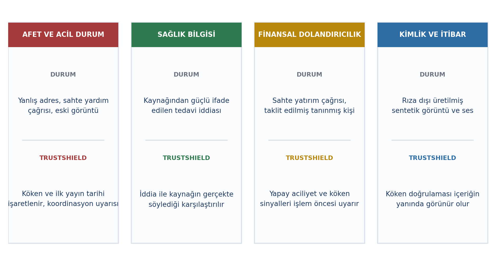

# 5. YAYGIN ETKİ

> Kontrol listesi: erişim potansiyeli (0-3), ekosisteme katkı (0-2), somut örneklerle
> toplumsal fayda (0-3), dijital yaşam kalitesi (0-2). Toplam 10 puan.

---

## 5.1. Toplumsal Fayda ve Erişim Potansiyeli

### Erişim potansiyeli

TrustShield, bağımsız bir uygulama olarak da NSosyal gibi bir platform içinde çalışan bir
alt sistem olarak da tasarlanmıştır. Bir platforma entegrasyon gerçekleştiğinde, sistemin
kullanıcıya ulaşması için ayrı bir indirme, kayıt veya kullanıcı kazanım süreci gerekmez;
entegrasyona kadar geçen sürede erişim bağımsız demo kullanıcıları ve pilot testler
üzerinden sağlanır.

Erişimin ölçeği, Türkiye'nin dijital göstergeleriyle doğrudan ilişkilidir — internet
kullanımı, en çok kullanılan uygulamalar ve habere duyulan güvenin seyri Bölüm 2.1'de
istatistiklerle ortaya konmuştur [2,5].

| Katman | Kullanıcı | Sağlanan fayda |
|---|---|---|
| Birincil | 18-30 yaş aktif sosyal medya kullanıcıları | Kanıt, köken, risk ve gösterim gerekçesi hakkında bağlam |
| İkincil | İçerik üreticileri | Taklit içerik ve koordineli karalamaya karşı köken doğrulaması |
| Üçüncül | Kurumsal kullanıcılar (medya, kamu iletişimi, marka) | Koordineli yayılım ve manipülasyon sinyallerinin erken tespiti |

| Erişimi artıran unsur | Neden işe yarar |
|---|---|
| Varsayılan olarak açık, yapılandırma gerektirmeyen tasarım | Doğrulama araçlarını *arayıp* kullanan kesim zaten en az risk altındaki kesimdir; TrustShield bilgiyi içeriğin yanına getirir |
| Taşınabilirlik | Çekirdek platformdan bağımsız bir analiz katmanı; farklı platformlara genişletilebilir |

### Sosyal medya ekosistemine katkı

| Düzey | Katkı |
|---|---|
| Platform | Gösterim gerekçesi açıklayan ve akış politikasını kullanıcıya bırakan bir platform, sektörde doldurulmamış bir konumu işgal eder |
| İçerik üreticisi | Köken doğrulama, kopyalama/taklit/koordineli hedef almayı görünür kılar; bu da doğrulanmış üreticinin görünürlüğüne dolaylı katkı sağlar |
| Ekosistem | Zamansal örüntülerin tespit edilebilir hâle gelmesi, koordineli manipülasyon kampanyalarının maliyetini yükseltir [7] |

### Toplumsal fayda: uygulama senaryoları

Aşağıdaki dört senaryoda ortak ilke şudur: sistem kesin hüküm vermez, **risk sinyali ve
kanıt düzeyi** sunar. Özellikle bu dört alanda yanlış pozitifin maliyeti yüksektir; bu
nedenle çıktı her zaman "kesinlikle yanlış" değil "yüksek risk sinyali" veya "kanıt
yetersiz" biçimindedir.

| Ortam | Risk | Sistemin katkısı | Belirsizlik durumunda |
|---|---|---|---|
| Afet ve acil durum | Yanlış adres, sahte yardım çağrısı, eski görüntünün güncelmiş gibi paylaşılması | Görselin ilk yayın tarihi ve kökenini işaretler; koordinasyon sinyali üretir | Kanıt yetersizse içerik silinmez, yalnızca "doğrulanamadı" etiketiyle gösterilir |
| Sağlık bilgisi | Kaynağından daha güçlü ifade edilen tedavi/ilaç iddiaları | İddia ile kaynağın gerçekte söylediğini karşılaştırır | Kaynak-iddia uyumu düşükse "kanıt kısmi" olarak işaretlenir, "yanlış" denmez |
| Finansal dolandırıcılık | Sahte yatırım çağrısı, taklit edilmiş tanınmış kişi görüntüsü | Yapay aciliyet, sosyal baskı örüntülerini işlem öncesi işaretler | Tek bir sinyal (ör. yalnızca aciliyet dili) tek başına "dolandırıcılık" ilan etmez |
| Kimlik ve itibar | Rıza dışı üretilmiş sentetik görüntü/ses | Köken doğrulaması içeriğin yanında görünür olur | Meta veri yoksa olasılık sinyaliyle gösterilir, kesinlik iddia edilmez |

:::KRİTİK TASARIM KARARI
Sistem içeriği silmez, yalnızca bağlam ekler. Afet gibi kritik senaryolarda bu, gerçek bir yardım çağrısının yanlışlıkla engellenmesi riskini ortadan kaldırır.
:::

### Dijital yaşam kalitesine etkisi

| Katkı | Nasıl |
|---|---|
| Bilişsel yükün azalması | Ayrım gözetmeyen genelleşmiş şüphe yorucudur [5]; sistem yerine içerik başına bağlam koyar |
| Dijital okuryazarlığın gelişmesi | Açıklamalar yalnızca sonuç değil gerekçe sunar; kullanıcı örüntüleri zamanla kendisi tanımaya başlar |
| Kullanıcı denetiminin geri kazanılması (User Control) | Sistem ne göreceğini dayatmaz; akış politikasını doğal dille tanımlama imkânı verir; aşağı sıralanan içerik gerekçesiyle görünür kalır ve geri alınabilir |

Bu tasarım, algoritmik şeffaflık ve kullanıcı özerkliği tartışmasına somut bir yanıt
oluşturur: kullanıcı kendisi hakkında alınan kararların hem gerekçesini görür hem de bu
kararları değiştirebilir.
