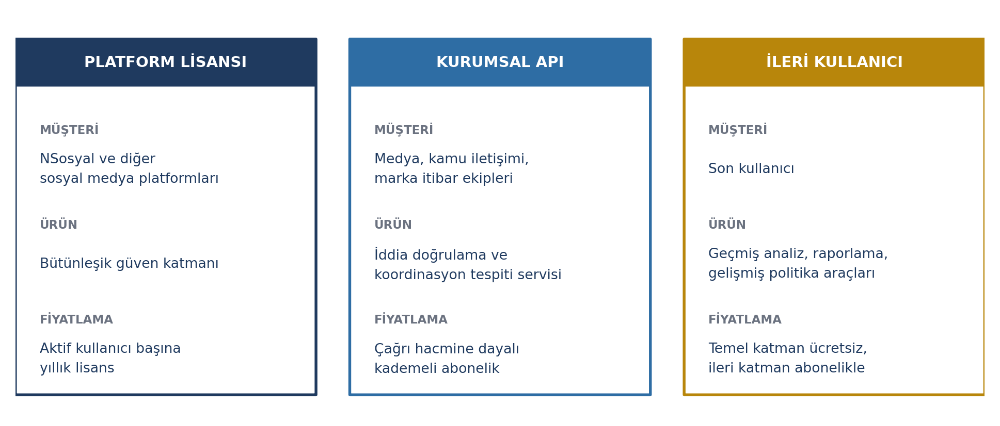
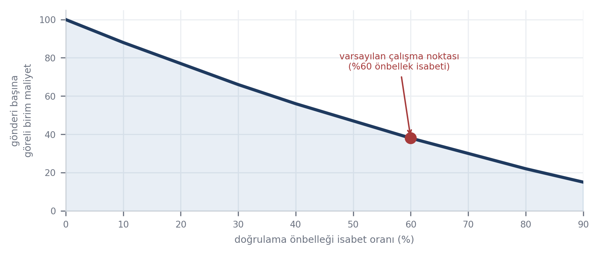
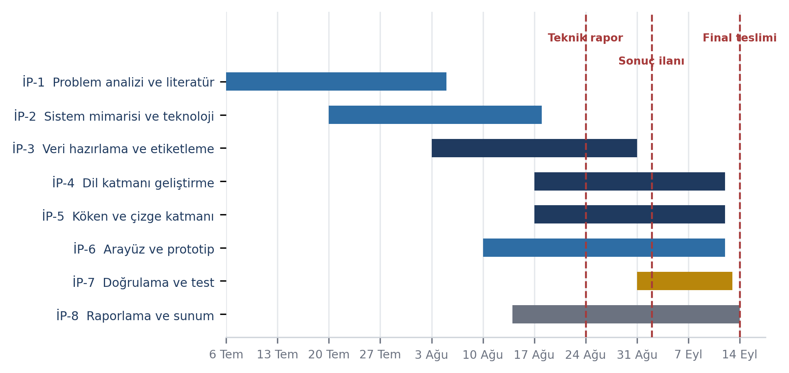

# 6-7-8. SÜRDÜRÜLEBİLİRLİK, PROJE TAKVİMİ VE TAKIM YAPISI

> Toplam 15 puan. Bütçe: Bölüm 6 için 2,5 sayfa, Bölüm 7 için 1,5 sayfa, Bölüm 8 için
> 1 sayfa.

---

## 6. SÜRDÜRÜLEBİLİRLİK

## 6.1. Ticarileştirme Potansiyeli ve İş Modeli

### Gelir modeli

TrustShield, son kullanıcıdan ücret almayan ancak üç ayrı kanaldan gelir üretebilen bir
yapıda kurgulanmıştır — güvenilirlik bilgisinin ödeme gücüne bağlı hâle gelmesi, sistemin
en çok fayda sağlayacağı kesimi dışarıda bırakırdı.

Platform lisansı hedeflenen birincil kanaldır; bir entegrasyon anlaşması gerçekleştiğinde
ilk müşteri ile ilk kullanıcı kitlesi aynı adımda kazanılır. Kurumsal API, koordineli
yayılım tespiti ve itibar yönetimi pazarına açılan, platform iş birliğinden bağımsız
başlatılabilecek ikinci kanaldır — ancak kurumsal bir API ürününün kimlik doğrulama,
izleme, hizmet seviyesi taahhüdü (SLA), güvenlik ve istek sınırlama (rate limiting)
altyapısı ayrı bir geliştirme kalemidir; "ek maliyetsiz" değildir.

### Sektöre ve ülke ekonomisine katma değer

| Katma değer | Açıklama |
|---|---|
| Teknolojik bağımsızlık | İçerik doğrulama çözümlerinin çoğu yurt dışı kaynaklı, Türkçe başarımı sınırlı; yerli altyapı bağımlılığı azaltır |
| Birikim ve insan kaynağı | Türkçe NLP ve zamansal çizge öğrenmesinde uygulamalı birikim; Türkçe değerlendirme kümesi projeden bağımsız da kullanılabilir |
| İhracat potansiyeli | Çekirdek mimari dile/platforma bağımlı değil; farklı dil ve platformlara uyarlanabilir |

### İş birliği potansiyeli

| Ortak | İş birliği |
|---|---|
| Bağımsız doğrulama kuruluşları | Doğrulanmış iddia veri paylaşımı |
| Üniversiteler ve araştırma merkezleri | Model geliştirme, veri kümesi genişletme |
| Kamu kurumları | Afet/kriz dönemlerinde resmî bilgi kaynaklarına öncelikli erişim |

## 6.2. Finansal, Teknik ve Sosyal Sürdürülebilirlik

### Finansal sürdürülebilirlik

Sistemin işletme maliyeti kademeli mimari sayesinde kullanıcı sayısıyla doğrusal olarak
artmaz: maliyet gösterim sayısına değil **benzersiz iddia sayısına** bağlıdır. Kullanıcı
tabanı büyüdükçe önbellek isabet oranı yükselir ve birim maliyet düşer.

### Teknik sürdürülebilirlik

Sistem, her analiz motorunun bağımsız güncellenebileceği modüler bir yapıda tasarlanmıştır.
Bakım planı üç unsurdan oluşur:

| Unsur | Uygulama |
|---|---|
| Düzenli yeniden eğitim | Değerlendirme kümesi genişletilir, modeller belirli aralıklarla yeniden eğitilir |
| Başarım izleme | Canlı ortamda kalibrasyon sapması ve yanlış pozitif oranı sürekli ölçülür |
| Düşmanca uyuma karşı tazeleme | Saldırı örüntüleri düzenli olarak değerlendirme kümesine eklenir |

### Sosyal sürdürülebilirlik ve değişen ihtiyaçlara uyum

| Kalıcı tasarım kararı | Etkisi |
|---|---|
| İçerik silinmez, yalnızca bağlam eklenir | Kullanıcı güveni korunur |
| Her politika kullanıcı tarafından değiştirilebilir (User Control) | Denetim kullanıcıda kalır |
| **İtiraz mekanizması** — yanlış işaretlenen içerik üreticisi yeniden inceleme talep edebilir | Otomatik kararın düzeltme yolu açık kalır |

Değişen kullanıcı ihtiyaçlarına uyum, politikaların doğal dille tanımlanabilir olmasıyla
sağlanır: yeni bir ihtiyaç için arayüze ayar eklemek gerekmez.

---

## 7. PROJE TAKVİMİ

## 7.1. İş Paketleri ve Zamanlama

Proje, iki kişilik ekibe uygun önceliklendirilmiş dokuz iş paketi hâlinde yürütülmektedir:
önce çekirdek altyapı, sonra sırayla Evidence, Origin, Risk motorları, ardından Why ve
User Control, en son arayüz/test/optimizasyon. Takvim; teknik rapor teslimi (24 Ağustos
2026), mentörlük süreci (2-7 Eylül 2026) ve final sunumları (14 Eylül 2026) tarihleriyle
uyumludur.

| İP | İş Paketi | Alt Faaliyetler | Süre |
|---|---|---|---|
| İP-1 | Problem analizi ve literatür taraması | Kaynak taraması, mevcut çözümlerin karşılaştırılması | Temmuz 2026 |
| İP-2 | Çekirdek altyapı (core backend) | FastAPI servisi, PostgreSQL+pgvector, kademeli mimari iskeleti | Temmuz – Ağustos 2026 |
| İP-3 | Evidence Engine | Veri hazırlama, iddia çıkarımı ve kanıt getirme prototipi | Ağustos 2026 |
| İP-4 | Origin Engine | C2PA kontrolü, YZ üretimi olasılık sinyali prototipi | Ağustos 2026 |
| İP-5 | Risk Engine (prototip) | Manipülatif dil sınıflandırması, kontrollü/sentetik koordinasyon senaryosu | Ağustos – Eylül 2026 |
| İP-6 | Why Engine ve User Control | Gösterim gerekçesi üretimi, doğal dille akış politikası | Eylül 2026 |
| İP-7 | Arayüz (UI) | Güven kartı, filtrelenenler çekmecesi, kullanıcı akışları | Ağustos – Eylül 2026 |
| İP-8 | Doğrulama ve test | Başarım ölçümü, kalibrasyon, kullanılabilirlik testi | Eylül 2026 |
| İP-9 | Optimizasyon ve final sunum hazırlığı | Gecikme/maliyet ince ayarı, sunum materyali, demo videosu | Eylül 2026 |

### Zaman çizelgesi

### Kilometre taşları

| Kod | Kilometre Taşı | Tarih |
|---|---|---|
| KT-1 | Çekirdek altyapının tamamlanması | Ağustos 2026, 2. hafta |
| KT-2 | **Teknik rapor teslimi** | **24 Ağustos 2026, 17.00** |
| KT-3 | Teknik rapor sonuçlarının açıklanması | 2 Eylül 2026 |
| KT-4 | Mentörlük süreci | 2-7 Eylül 2026 |
| KT-5 | Çalışan prototipin tamamlanması | Eylül 2026, 2. hafta |
| KT-6 | **Final sunumlarının teslimi** | **14 Eylül 2026, 17.00** |
| KT-7 | Jüri ve katılımcılara canlı sunum | 20 Eylül 2026 |
| KT-8 | TEKNOFEST Şanlıurfa | 30 Eylül – 4 Ekim 2026 |

---

## 8. TAKIM YAPISI

## 8.1. Takım Organizasyonu ve Roller

Takım, şartnamenin izin verdiği asgari büyüklükte, 2 kişiden oluşmaktadır.

| Üye | Disiplin | Rol | Sorumlu Olduğu İş Paketleri |
|---|---|---|---|
| Üye 1 (Takım Kaptanı) | Bilgisayar Mühendisliği | Ürün yönetimi, çekirdek altyapı, Evidence/Risk Engine, raporlama | İP-1, İP-2, İP-3, İP-5, İP-9 |
| Üye 2 | Bilgisayar Mühendisliği | Origin Engine, Why/User Control, arayüz, testler | İP-4, İP-6, İP-7, İP-8 |

İki kişilik ekip, yapay zekâ/veri ve yazılım/arayüz yetkinliklerini kapsayacak şekilde
bölünmüştür; bağımlılık taşıyan iş paketleri haftalık eşgüdüm toplantılarıyla senkronize
edilmektedir.
